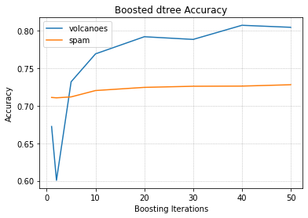

# ML Adaboost
Implements in Python the AdaBoost algorithm to improve the performance of weak base classifiers. Available base classifiers for using this implementation of AdaBoost are also implemented from scratch:
* decision tree
* naive Bayes
* logistic regression

AdaBoost will create an ensemble classifier of the specified type, which has a higher accuracy compared to an unboosted base classifier. 

### Instructions to Run
To train a classifier using AdaBoost, run the following command in a terminal in the base directory of this repository.

```python3 boost.py [path-to-dataset] [cross-validate] [base-classifier] [boosting-iterations]```  
* path-to-dataset: specify the directory where the dataset files are located + `/` + dataset name
* cross-validate: set 0 to perform 5-fold cross validation to evaluate classifier, set 1 to evaluate on whole dataset
* base-classifier: choose one of `dtree`, `nbayes`, or `logreg`
* boosting-iterations: specify the number of iterations to boost the base classifier

Example: `python3 boost.py data/volcanoes/volcanoes 0 nbayes 30`  
will use 5-fold cross validation to train and evaluate an ensemble naive Bayes classifier, boosted for 30 iterations, on the volcanoes dataset.

### Summary Results
Full results can be viewed in Jupyter notebook included in this repository.  
[Jupyter Notebook](notebook.ipynb)

Cross-Validated Accuracy of Decision Tree Classifier:
|  | Volcanoes | Spam |
| --- | --- | --- |
| Base Learner | 0.672 | 0.711 |
| Boosted Learner | 0.808 | 0.727 |

Cross-Validated Accuracy of Decision Tree Classifier for Different Boosting Iterations:


### Python Dependencies:
* numpy
* argparse


